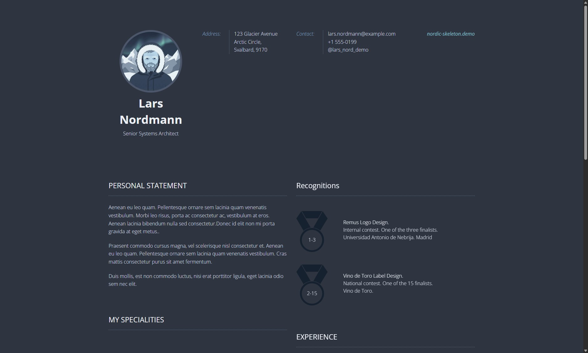

# Nord Resume Skeleton for Grav



<div align="center">

[](https://nordic-skeleton.gshoots.hu/)

</div>

**Nord Resume** is a modern, privacy-focused adaptation of the classic Grav Resume theme. It has been completely overhauled with the [Nord color palette](https://www.nordtheme.com/), automatic Dark/Light mode, and FontAwesome 7 icons.

# Features

* ❄️ **Nord Color Palette:** Elegant, stress-free colors (Polar Night, Snow Storm, Frost, Aurora).
* 🌓 **Auto Dark/Light Mode:** Automatically adapts to your system preferences (`prefers-color-scheme`).
* 🚀 **FontAwesome 7:** Upgraded icon system (v7.1.0) using local assets (no external tracking/CDN issues).
* 🔧 **Configurable:** Gravatar size, toggles, and footer text are editable via Admin Panel.
* 📱 **Fully Responsive:** Mobile-first approach based on the Foundation framework.
* **Classic Layouts:** Includes all the beloved layouts from the original theme (Specialities, Skills, Experience, Education).

## Basic Setup

The simplest way to install Nord Resume is to download the Skeleton package (which includes Grav + Theme + Content):

1. Go to the [Releases page](https://github.com/megvadulthangya/grav-skeleton-resume-nordic-site/releases).
2. Download the latest `.zip` package.
3. Unzip the package into your web root folder (e.g. `/var/www/html`).
4. Point your browser at the folder, job done!

**TIP:** Check out the [general Grav installation instructions](http://learn.getgrav.org/basics/installation) for more details.

---

## Existing Grav site

If you already have a Grav site, you can install just the theme:

```bash
git clone [https://github.com/megvadulthangya/grav-theme-resume-nordic.git](https://github.com/megvadulthangya/grav-theme-resume-nordic.git) user/themes/resume-nordic
````

Then enable it in your `user/config/system.yaml`:

```yaml
pages:
  theme: resume-nordic
```

# Layouts Configuration

Nord Resume includes creative layout templates to help you create the perfect CV. Below is a description of the most important layouts and options.

## Header & Contact

Header settings are located inside **user/config/site.yaml**. This file contains your basic contact information, address, and profile settings.

To change your profile picture, you can either:

1.  Use your Gravatar email in `site.yaml`.
2.  Configure the size and visibility in the **Admin Panel \> Themes \> Nord Resume**.

## Specialities

Specialities layout is designed to showcase your most important talents. It contains a large icon inside a circle. Example location: **pages/left/my-specialities/special.md**.

```markdown
- icon: lightbulb
  text: Logo Design
  animation: fadeInDown
```

  * **icon**: Select any free icon from [FontAwesome 7](https://fontawesome.com/search?o=r&m=free). Use the class name without `fa-` prefix (e.g. `lightbulb`, `layer-group`, `chart-line`).
  * **text**: Description of your speciality.
  * **animation**: Animate elements using [Animate.css](https://daneden.github.io/animate.css/) classes.

## Skills

Skills layout showcases your expertise levels. Example location: **pages/left/design-skills/skills.md**.

```markdown
- name: Adobe Photoshop
  level: 8
```

  * **name**: Your skill name.
  * **level**: Skill level from 1-8. (e.g., **5** means 5 colored circles and 3 greyed out).

## Language skills - Pie charts

Easily display percentage data like language proficiency.
Example location: **pages/left/language-skills/langskills.md**.

```markdown
- name: Spanish
  level_name: Mother Language
  level: 100
```

  * **level**: Percentage to display (0-100).

## Education

Layout for your education history. Example location: **pages/right/education/education.md**.

```markdown
- date: From September 2010 to September 2013.
  topic: Industrial Design.
  school: Universidad Antonio de Nebrija. Madrid.
```

## Experience

Showcase your work experience with a timeline. Example location: **pages/right/experience/experience.md**.

```markdown
- date: From 2013 to 2014
  role: Art Director.
  company: Creative Agency
  years: 2
  animation: fadeIn
  description: "You can now add <b>HTML</b> descriptions here!"
```

  * **years**: The big number displayed in the timeline.
  * **description**: (New) Supports detailed description with HTML formatting.

## Recognitions

Showcase awards with an SVG ribbon. Example location: **pages/right/recognitions/recognitions.md**.

```markdown
- title: Best Design Award
  desc: International Contest
  place: London, UK
  position: 1
  animation: fadeIn
```

## Hobbies and Interests

Simple circles with icons. Example location: **pages/right/hobbies-and-interests/interests.md**.

**Important:** This theme uses FontAwesome 7. Please use modern icon names.

```markdown
- icon: camera-retro
  text: Photography
  animation: fadeIn
- icon: person-hiking
  text: Hiking
  animation: fadeIn
```

  * **icon**: Search for icons on [FontAwesome](https://fontawesome.com/search?o=r&m=free).
  * **text**: Icon description.

## Footer

The footer copyright text and credit links can now be configured directly in the **Grav Admin Panel**, so you don't need to edit Twig files manually.

-----

### Credits

  * Original Resume Theme by [Fernando Báez](https://www.behance.net/gallery/FREE-Resume-Template/15677411) & Team Grav.
  * Nord adaptation & refactoring by [Gábor Gyöngyösi](https://github.com/megvadulthangya).
---

<div align="center">

**Is it cold out there?** ❄️  
If this skeleton saved you hours of debugging dependency hell, consider warming me up with a coffee! ☕

[](https://www.buymeacoffee.com/rohambili)

</div>
